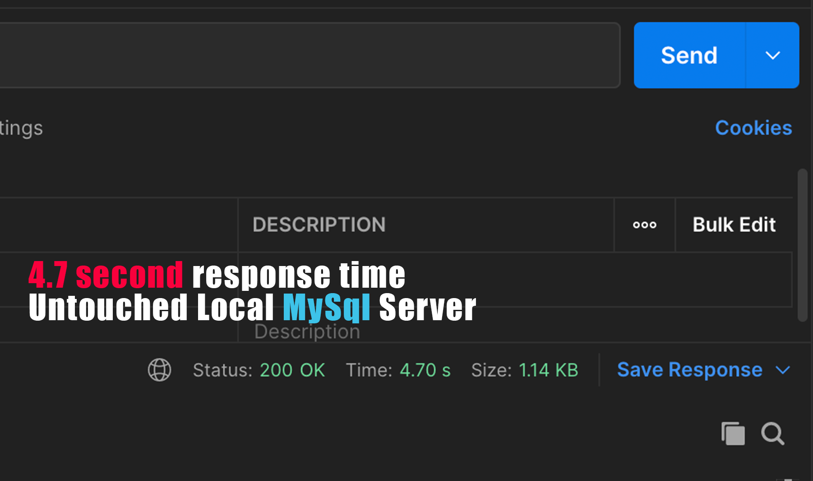
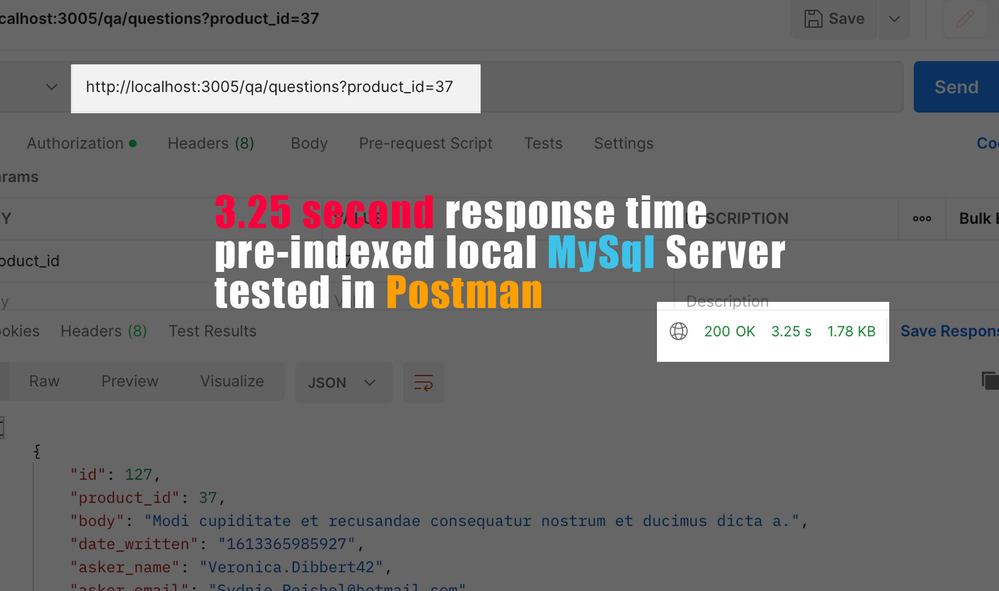
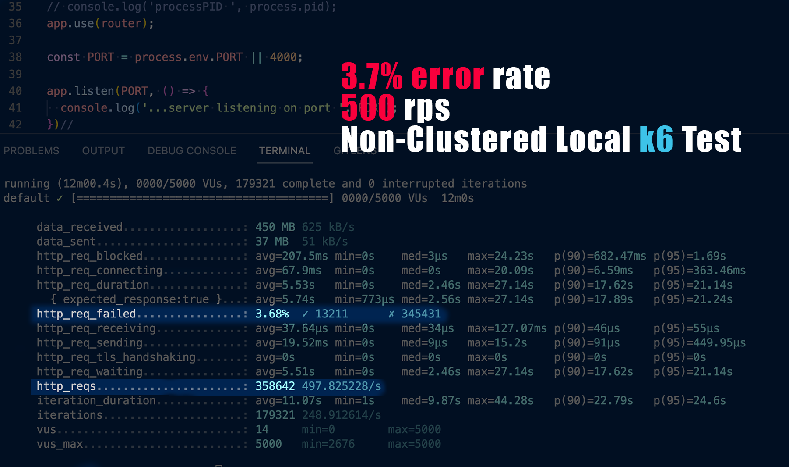

# Elevated Apparel - Question and Answer API

This API serves up millions of Questions & Answers for [Atelier's e-commerce site](https://github.com/atelier-front-end/elevated).

insert gif or image HERE

## Overview

### Tech Stack

Atelier's Q & A API runs on 4 AWS EC2 instances:
- 2 clone Node Servers (via AWS AMI)
- 1 NGINX Load Balancing Server
- 1 MySql Database w/ Redis Server

### Initial Goals

Initial tests showed a repsonse time of > 2000ms. With this benchmark in mind, and expectations , an initial goal was set for the server to handle 10,0000 clients/second (to handle spikes in traffic) with an error rate of < 1%. These goals were met, primarily from the help NginX load-balancing (alleviating server restrictions) and MySql indexing (alleviating database bottleneck).

## Planning and Considerations

### Database Choice

MySql was chosen for this service for its reliability, scalibility, and speed. The throughput was able to reach very high numbers (10k rps) that would difficult to mimic with no-Sql document-based alternative Databases.

### ETL Process

Originally, a Sql connection was secured via the 'MySql Workbench' software, and data was loaded via the 'Import Wizard.' However, loading the existing Questions (which numbered above 3 mil rows) took over 4 hours, which was likely "fast" compared to how long it could take Answers to load (over 6 mil rows). An alternative strategy was necessary as data had to be transfered numerous times for testing purposes and to migrate from local to deployed sql server.

The alternative strategy was to avail of MySql's 'load infile' CLI command. This reduced transfer time from 4+ hrs down to a whopping 5 minutes, and was used to migrate existing Answers.

### Schema Design

The relational database consists of 3 tables (Questions, Answers, and Photos per each Answer):
* Question Schema (questions table)
* Answer Schema (answers table)
* Photos Schema (photos table)

## Performance Optimization & Refactoring

### Local Testing

Before deployment, local optimizations seemed necesssary as simple queries to the DB took over 4 seconds. This wasn't a huge surpise given the 3million and 6 million rows in both question and answer tables, respectively.

##### Indexing
After indexing for the numerical "productId", upon which each Q & A was queried, the response time improved drastically (from 2-4 seconds down to 20-120ms)

|                    Before Indexing                     |                    After Indexing                     |
| :------------------------------------------------: | :-----------------------------------------------: |
|  |  |

##### Node.js Clusters
I decided that Server Requests could be split between multiple child processes to avail of all available CPUs. Forking child-processes overrides Node's default single-thread configuration via the Cluster Module that is provided by it.

This afterthought improved local K6 performance metrics from ~500 rps to ~800 rps and reduced request errors from 3.7% to 0.5%

|                    Single-Thread Node Server                     |                    Introduced Node Clusters                     |
| :------------------------------------------------: | :-----------------------------------------------: |
|  |  |

### Deployment:

After deploying the database and Node server to discrete AWS EC2 instances, stress testing with [loader.io](loader.io) demonstrated that the service could handle throughput of ___ rps with ___ms average response time (including 65-70ms loader.io latency period) and an error rate of .8% with a single host server.

### Load Balancing:

To get to the final goal of 1000RPS at <2000ms avg response time, and NGINX load balancer was created and deployed to the AWS system to distribute request in round-robin fashion.

### Further Optimizations:

After 2 servers were running, demonstrating excellent metrics, a Redis Server was introduced on the same instance as the MySql Server.
This didn't show concrete results in deployment, as [Loader.io]() was randomly testing the last 10% of a multi-million row database; therefore, it was unlikely that the same cached query would be hit enough times to affect overall response times. 

However, locally response times dropped from ~30ms down to ~5ms for cached queries, which demonstrates that a user using the webpage experience lightning-fast responose times for previously visited pages. 
This would also take stress off of the Database, allowing for more queries until the DB would need to be scaled up due to bottleneck issues.

## Conclusion
The system can efficiently handle 10k RPS with 130ms avg. response time and with an error rate of 0%.

Stress tests show the breaking point to be around this throughput.

## Future Improvements

To further optimize this API, a larger computer (AWS instance) with more threads could be deployed to so Node Clusters could be taken advantage of, as they were on the local end.

## Further Documentation

- [Deployment Instructions](/Deployment-Instructions.md)
